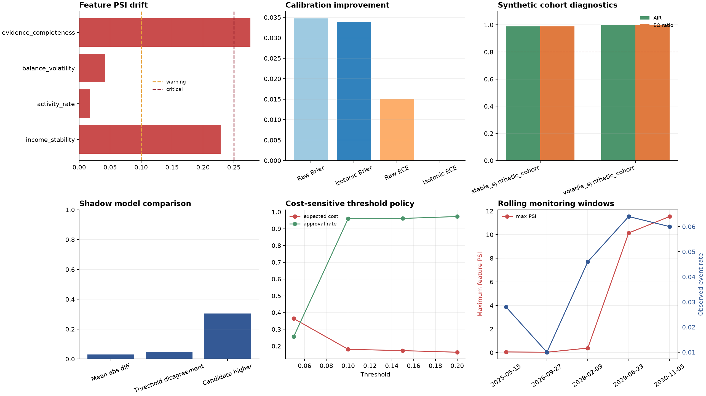

# Default Risk Lifecycle: Full Report

## Executive Summary

**Lifecycle status:** `critical`  
**Recommended action:** `pause_automation_and_recalibrate_or_rollback`

This synthetic report connects model development, label governance, leakage prevention, calibration, cohort diagnostics, shadow scoring, and production-style monitoring.



## Model Registry

```json
{
  "active": {
    "model_version": "model-v1",
    "status": "active",
    "calibration": "isotonic",
    "training_window": "synthetic-chronological-60-20-20",
    "feature_schema_version": "features-v1",
    "rollback_target": null
  },
  "candidate": null,
  "promotion_rule": "promote only after holdout, calibration, drift, and cohort checks",
  "rollback_rule": "rollback when monitoring status is critical or candidate degrades cohort metrics"
}
```

## Label Quality

```json
{
  "delayed": 0.6,
  "timely": 0.4
}
```

Only timely and mature labels should be eligible for training. Delayed or immature labels are tracked rather than silently treated as truth.

## Leakage Check

- Future events used in history features: `False`
- History rows: `3000`
- Feature schema: `income_stability, activity_rate, balance_volatility, evidence_completeness`

## Calibration

| Metric | Value |
| --- | ---: |
| Raw Brier | 0.034755 |
| Isotonic Brier | 0.033856 |
| Raw ECE | 0.015132 |
| Isotonic ECE | 0.000000 |

## Synthetic Cohort Diagnostics

| Cohort | Rows | Approval rate | Adverse impact ratio | Equal opportunity ratio |
| --- | ---: | ---: | ---: | ---: |
| stable_synthetic_cohort | 2143 | 0.957 | 0.988 | 0.989 |
| volatile_synthetic_cohort | 857 | 0.968 | 1.000 | 1.000 |

These are synthetic cohorts and not real protected groups or a fairness certification.

## Shadow Model

```json
{
  "mean_absolute_difference": 0.030756380314107504,
  "disagreement_rate_at_10pct": 0.049,
  "candidate_higher_rate": 0.305
}
```

## Monitoring

```json
{
  "status": "critical",
  "action": "pause_automation_and_recalibrate_or_rollback"
}
```

Feature drift, prediction shift, current Brier score, and lifecycle policy are evaluated together. A critical result recommends pausing automation and recalibrating or rolling back.

## Data Contract and Rolling Monitoring

- Contract version: `features-v1`
- Contract validation errors: `[]`
- Rolling monitoring windows: `5`

## Cost-sensitive Thresholds

| Threshold | Expected cost | Approval rate | Review rate | False-accept rate |
| ---: | ---: | ---: | ---: | ---: |
| 0.05 | 0.3641 | 0.256 | 0.502 | 0.003 |
| 0.10 | 0.1807 | 0.960 | 0.000 | 0.030 |
| 0.15 | 0.1727 | 0.961 | 0.011 | 0.030 |
| 0.20 | 0.1633 | 0.973 | 0.027 | 0.031 |

## Reproduce

```powershell
python scripts/run_full_report.py --scenario all
```
