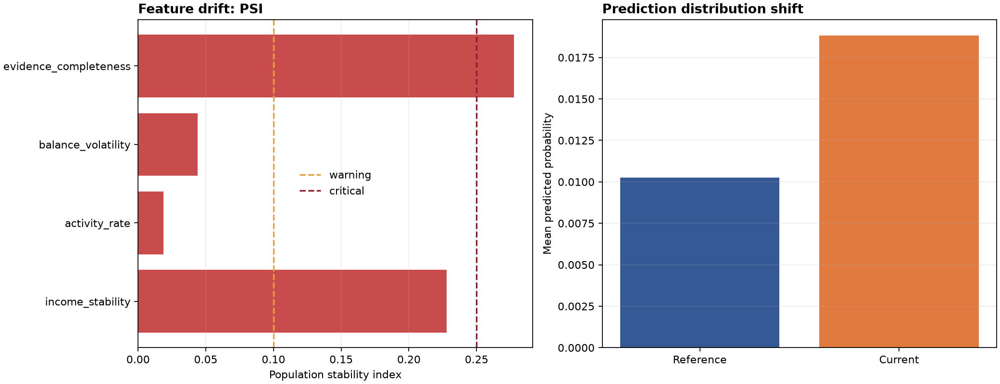

# Default Risk Lifecycle Report

> Synthetic model lifecycle evaluation. No production model files or real data are used.

## Executive summary

**Lifecycle status:** `critical`  
**Recommended action:** `pause_automation_and_recalibrate_or_rollback`

The model is trained and calibrated on historical synthetic data, then evaluated against a simulated current population. Monitoring covers feature drift, prediction shift, and calibration degradation.

## Metrics

| Metric | Value |
| --- | ---: |
| ROC AUC | 0.671931 |
| Training holdout Brier | 0.015542 |
| Current Brier | 0.038097 |
| Max feature PSI | 0.277554 |
| Prediction mean shift | 0.008576 |

## Monitoring dashboard



## Feature drift

PSI is used as a simple distribution-shift diagnostic. Thresholds are versioned in the monitoring policy and are illustrative.

| Feature | PSI |
| --- | ---: |
| income_stability | 0.227847 |
| activity_rate | 0.018703 |
| balance_volatility | 0.043860 |
| evidence_completeness | 0.277554 |

## Lifecycle interpretation

- `healthy`: continue monitoring;
- `warning`: start shadow monitoring and investigate;
- `critical`: pause automation and recalibrate or rollback.

## Methodology

1. Generate a stable historical synthetic population.
2. Train a logistic model on the earliest time segment.
3. Fit isotonic calibration on the next segment.
4. Evaluate ranking and probability quality on the holdout.
5. Generate a current population with an optional drift scenario.
6. Measure PSI, prediction shift, missingness, and current Brier score.
7. Convert diagnostics into a lifecycle recommendation.

## Limitations

The dataset is synthetic and the monitoring thresholds are illustrative. A production system would add model registry integration, rolling windows, alert deduplication, shadow model comparison, recalibration validation, rollback automation, and governance review.

Reproduce with:

```powershell
python scripts/run_monitoring_report.py --scenario all
```
